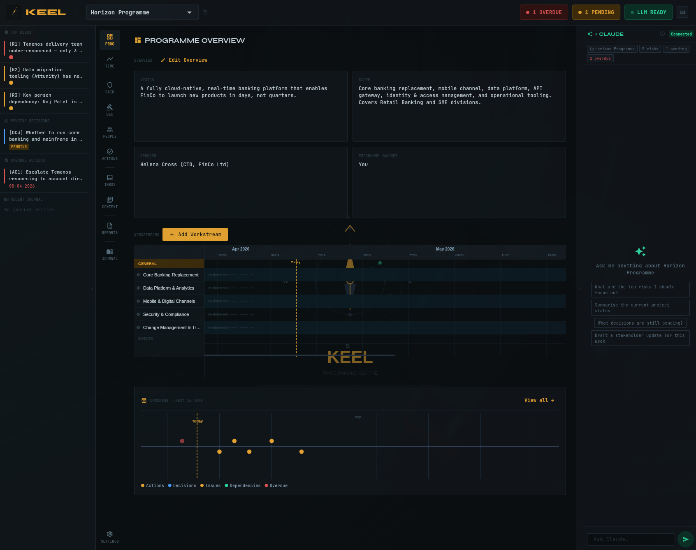

# Keel

A local-first command centre for Technical Programme Managers. Manage your programme, track RAID logs, decisions, actions, people, and journal — all stored on your machine, with optional encrypted sync across devices.

Built with Flutter for Linux, macOS, and Windows.



---

## Features

- **Programme Overview** — workstream tracking with Gantt chart timeline
- **RAID Log** — Risks, Assumptions, Issues, Dependencies
- **Decisions** — decision register with rationale and outcomes
- **Actions** — task tracking with categories, assignees, and due dates
- **People** — team directory with roles and contact details
- **Inbox** — file watcher and AI-assisted item triage
- **Context** — entries, document library, and glossary
- **Journal** — daily notes with Vim mode and slash commands
- **Playbook** — reusable stage templates for programme delivery
- **Reports** — programme status exports
- **Encrypted sync** — end-to-end encrypted cross-device sync via [keel-app.dev](https://keel-app.dev)
- **LLM integration** — Claude, OpenAI, Grok, GitHub Models, Azure OpenAI, Ollama
- **Keyboard-driven** — Doom Emacs-style leader key navigation (`SPC`)

---

## Download

Grab the latest release for your platform from the [Releases](../../releases/latest) page.

| Platform | Download |
|----------|----------|
| Windows  | `keel-windows-setup.exe` (installer) or `keel-windows.zip` (portable) |
| macOS    | `keel-macos.dmg` |
| Linux    | `keel-linux.tar.gz` |

### Installation

**Windows (installer)**
Run `keel-windows-setup.exe`. Installs to `AppData\Local\Programs\Keel` with Start Menu entry and uninstaller. No admin rights required.

**Windows (zip)**
Extract `keel-windows.zip` and run `keel.exe` from the folder. Use this if the installer is blocked by your organisation's security policy.

**macOS**
Open `keel-macos.dmg`, drag `Keel.app` to your Applications folder.
> Note: Keel is ad-hoc signed. On first launch, right-click → Open to bypass Gatekeeper.

**Linux**
```bash
tar -xzf keel-linux.tar.gz
cd keel
./install.sh
```
Installs to `~/.local/share/keel/`, creates an app launcher entry, and adds `keel` to your PATH. No root required.

---

## Keyboard Shortcuts

Keel uses a Doom Emacs-style leader key. Press `Space` to activate, then:

| Keys | Action |
|------|--------|
| `SPC SPC` | Programme overview |
| `SPC t` | Timeline |
| `SPC r r` | RAID › Risks |
| `SPC r a` | RAID › Assumptions |
| `SPC r i` | RAID › Issues |
| `SPC r d` | RAID › Dependencies |
| `SPC d` | Decisions |
| `SPC d n` | New decision |
| `SPC p` | People |
| `SPC a` | Actions |
| `SPC i` | Inbox |
| `SPC c e` | Context › Entries |
| `SPC c d` | Context › Documents |
| `SPC c g` | Context › Glossary |
| `SPC R` | Reports |
| `SPC j` | Journal |
| `SPC P` | Playbook |
| `Ctrl+j` | Open journal (new entry) |
| `Ctrl+Shift+j` | Open journal (history) |

Append `n` to most section shortcuts to open the new item form directly (e.g. `SPC r r n` → new risk).

---

## Development

**Prerequisites**
- Flutter SDK (stable channel)
- For Linux: `libsecret-1-dev`, `libgtk-3-dev`

```bash
git clone https://github.com/paulhmurray/keel.git
cd keel
flutter pub get
flutter run -d linux   # or macos / windows
```

**Database code generation** (after schema changes):
```bash
dart run build_runner build --delete-conflicting-outputs
```

---

## Sync Server

The optional sync server lives in `/server` and is deployed on [Fly.io](https://fly.io).

```bash
cd server
fly deploy
```

---

## License

MIT — see [LICENSE](LICENSE).
